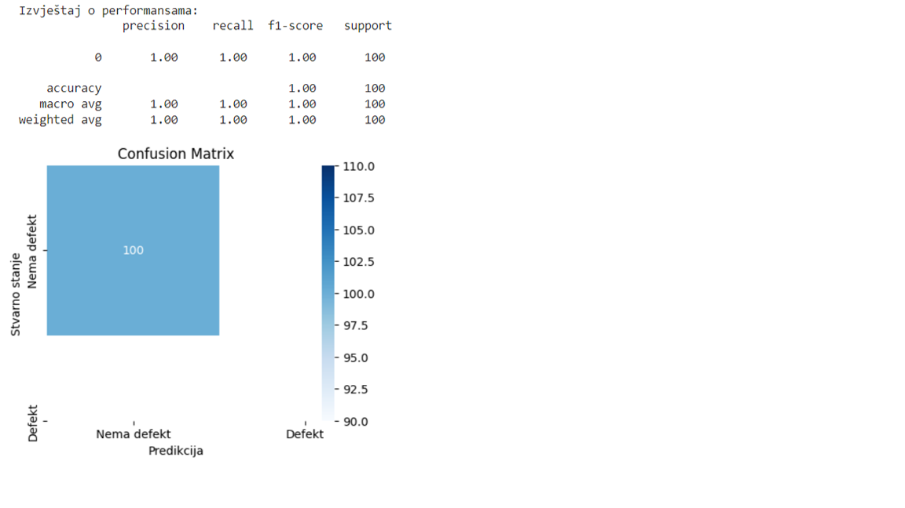

📘 ML Software Defect Detection
A Machine Learning project for predicting software defects using classical ML models and feature-based analysis.

🚀 Overview
Software systems often contain hidden defects that can significantly increase maintenance costs and reduce product reliability.
This project builds and evaluates supervised machine learning models that predict whether a software module is defective or clean based on historical metrics.
The goal of this project is to provide an automated, data-driven approach for early defect identification, helping QA teams and software engineers prioritize testing efforts and improve software quality.

✨ Key Features
Data preprocessing and feature normalization
Exploratory data analysis (EDA) with visualizations
Training multiple ML classifiers (Logistic Regression, Random Forest, etc.)
Model evaluation using accuracy, precision, recall, F1-score
Feature importance visualization
Confusion matrix and performance plots

🛠️ Tech Stack
Python
Pandas, NumPy
Scikit-learn
Matplotlib, Seaborn
Jupyter Notebook

📊 Results & Metrics
The final trained model achieved:

⚙️ Installation & Setup
1. Clone the repository
git clone https://github.com/njanjahier/ML-Software-Defect-Detection.git
cd ML-Software-Defect-Detection

2. Install dependencies
Make sure you have Python 3.8+ installed.
pip install -r requirements.txt

3. Run the Jupyter Notebook
jupyter notebook

Open:
ML_Software_Defect_Detection.ipynb

🧪 How to Use
The project is structured into clear logical steps:
1.Load & preprocess dataset
2.Perform EDA and visualize distributions
3.Train ML models
4.Evaluate performance
5.Analyze feature importance

You can run the notebook end-to-end or reuse the model-training sections in new datasets.

📅 Roadmap
Future improvements may include:
-Adding additional ML models (XGBoost, LightGBM)
-Hyperparameter tuning
-Deploying the model as a REST API
-Automated testing and CI integration
-Cross-project generalization study.

📜 License
This project is released under the MIT License.

